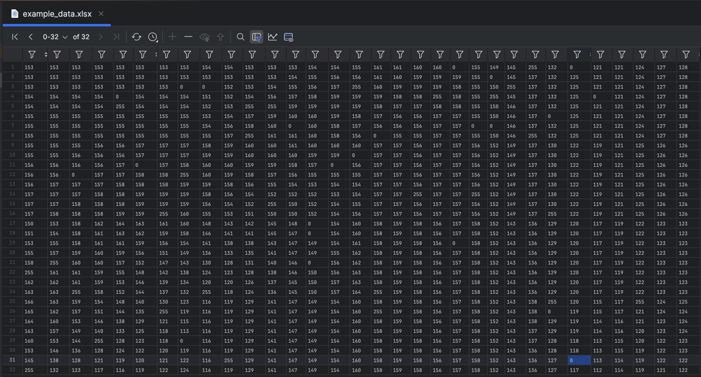
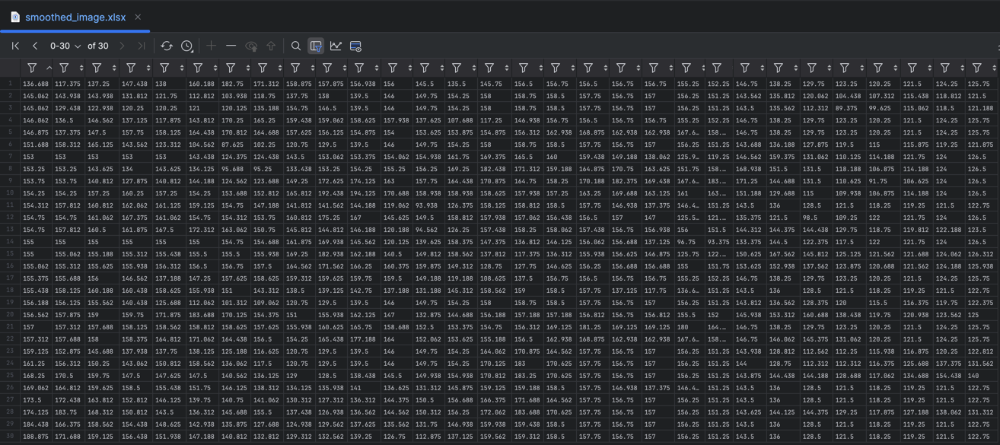

# 📊 Gaussian Smoothing Script

This repository contains a Python script for performing Gaussian smoothing on image data stored in an Excel file.

## 📋 Table of Contents
- [📖 Description](#-description)
- [✨ Features](#-features)
- [🛠️ Requirements](#-requirements)
- [💾 Installation](#-installation)
- [🚀 Usage](#-usage)
- [📝 Example](#-example)
- [🙏 Acknowledgements](#-acknowledgements)

## 📖 Description

The script reads image data from an Excel file, applies a Gaussian filter to smooth the image, and saves the processed image data into a new Excel file. Gaussian smoothing is a technique used to reduce noise and detail in an image by averaging the pixel values with a Gaussian kernel.

## ✨ Features

- Reads image data from an Excel file.
- Applies a Gaussian filter to smooth the image data.
- Saves the smoothed image data to a new Excel file.

## 🛠️ Requirements

- Python 3.x
- numpy
- pandas

## 💾 Installation

1. Clone the repository:
   ```sh
   git clone https://github.com/Renanuya/gaussian-smoothing-python.git
   cd gaussian-smoothing-script
   ```

2. Install the required Python packages:
   ```sh
   pip install numpy pandas
   ```

## 🚀 Usage

1. Place your input Excel file (`example_data.xlsx`) in the `data` directory.

2. Run the script:
   ```sh
   python main.py
   ```

3. The script will process the data and save the smoothed image to a new Excel file (`smoothed_image.xlsx`) in the `data` directory.

## 📝 Example

When the script is executed, it performs the following steps:

1. Reads the image data from `data/example_data.xlsx`.
2. Applies a Gaussian filter to the data.
3. Saves the smoothed data to `data/smoothed_image.xlsx`.

Here is a simplified view of the input and output data:

- **Original Data** (example):


- **Smoothed Data** (example):


## 🙏 Acknowledgements

- [numpy](https://numpy.org/)
- [pandas](https://pandas.pydata.org/)

Feel free to reach out if you have any questions or need further assistance!